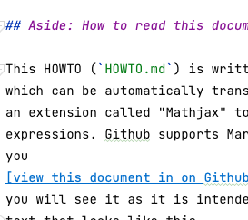
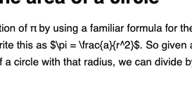
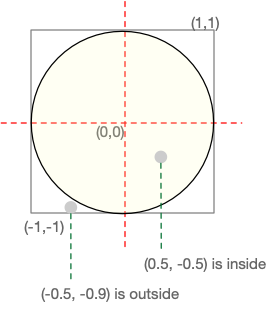
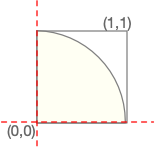
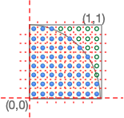
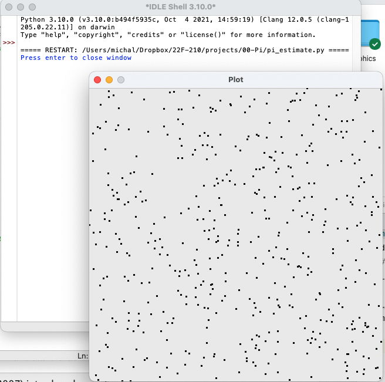

# Approximate Pi by sampling points

Pi (π) is defined as the ratio of a circle's circumference to its 
diameter, which is twice its radius. It appears in many other 
formulas in mathematics and physics, often in contexts that have 
nothing to do with geometry.  

Because π is an irrational 
number, it is not possible to represent it exactly with a Python 
floating point number, or with any rational number.  The best we can 
do is an approximation.

## Aside: How to read this document

This HOWTO (`HOWTO.md`) is written in a notation called "Markdown", 
which can be automatically translated to HTML for display.  It uses 
an extension called "Mathjax" to format some mathematical 
expressions. Github supports Markdown and Mathjax natively, so if 
you
[view this document in on Github](https://github.com/UO-CS210/pi/blob/main/docs/HOWTO.md)
you will see it as it is intended to be read.  If you are seeing 
text that looks like this



or with parts that look like this 



I recommend you 
[read it through Github](https://github.com/UO-CS210/pi/blob/main/docs/HOWTO.md). 

## Approximation methods

[Wikipedia](https://en.wikipedia.org/wiki/Approximations_of_%CF%80)
describes several methods that have been used for approximating π, 
from about 1000 BCE to current times.  Many of these involve rather 
daunting mathematical formulae involving continued fractions or 
series.  They are efficient, but difficult to understand. 

The method we will use in 
this project is not among the standard approaches.
Instead, it illustrates a 
general approach for numerical estimation called _Monte Carlo 
simulation_.  Monte Carlo simulation is useful in a wide variety of 
other estimation tasks such as environmental risk analysis and
analyzing complex animal behaviors.
Estimating π is a simple example that will 
help you understand how you might use the Monte Carlo method for 
other problems. 

### Monte Carlo methods

Monte Carlo is a city-state in Europe known for casinos and 
gambling.  Gambling typically involves a random process, such as 
rolling dice or drawing cards.  Monte Carlo simulation is a method 
of estimating something that is difficult to calculate directly.
It works by 
randomly generating many examples and counting how many of them 
satisfy a property of the thing we want to estimate.  For example, 
the 
[current best computer Go programs](https://en.wikipedia.org/wiki/AlphaGo) 
estimate the "goodness" of a 
position by playing out a number of random games from the position 
and counting the wins.  Some ecological simulations use a similar 
approach, generating many possible scenarios to estimate the 
likelihood of different outcomes.  

## Estimating π from the area of a circle

We will base our Monte Carlo estimation of π by using a familiar 
formula for the area of a circle, $a = \pi r^2$. With a little algebra 
we can rewrite this as $\pi = {a}/{r^2}$.  So given any value $r$,
if we can obtain a good estimate for the area of a circle with that 
radius, we can divide by the square of $r$ to get an estimate of π. 
In particular, we could choose $r = 1$, because conveniently 
$1^2 = 1$ and ${a}/{1} = a$.  

The other formula we will use is the definition of a circle in a 
Cartesian plane as consisting of all the points $(x,y)$ with 
distance at most $r$ from the center of the circle.  If we place the 
center of the circle at the origin, $(0,0)$, then the points that 
belong to the circle are those for which $\sqrt{x^2 + y^2} \leq r$.
Choosing $r=1$ lets us simplify this to $x^2 + y^2 \leq 1$.

Letting $r = 1$, we can imagine a circle of radius 1 inscribed 
in a rectangle of area 4.  



We cannot count all the points within the circle or the square, 
because there are an infinite number of them. However, we can 
imagine dividing the square into very small pieces, 
taking one point in each piece, and counting how 
many of those points are within the circle. If we make the small 
pieces uniform, we would expect the fraction of them that are within 
the circle to be approximately π.  The smaller the grid, the closer 
our estimate will be to the true value of π.

We might prefer to consider only positive values of $x$ and $y$,
inscribing a quarter of a circle in a square of size 1.  



If we do it this way, and again divide the square into very small
pieces, we expect about $\pi / 4$ of them to be within the 
quarter-circle.  It is easy to multiply by 4 to get π.



For this problem it would be easy to divide the unit square into an 
evenly spaced grid.  We might use such a method (often in three or 
more dimensions, rather than two) to estimate the volume of some 
very complex shape.  For other problems, like estimating the value 
of a position in a board game, or the survival value of a behavior 
for an organism, it is much harder to define what a "grid" might be. 
This is where the randomness of a Monte Carlo simulation comes in: 
We may be able to randomly sample a space of possibilities even if 
it does not have a simple geometric form.  With the Monte Carlo 
method, we  simply scatter points at random instead of 
laying them out in a grid.


Our calculation method is the same whether we sample points along a 
grid or sample them randomly:  If we sample $N$ points, we 
expect about $\pi N / 4$ of them to be within the quarter circle.
We will use random sampling because it is simple and easy to adapt 
to a wide variety of other problems, including those that aren't 
so easy to interpret geometrically (like game outcomes). 

## Getting started

If you have not already done so, download this repository from 
Github and save it as a directory (folder) on the computer you will 
use to complete the project.  

[Download the zip from Github](img/download-zip.png)

Expand the zip file and move it to the folder where you keep 
projects for this class.  It should consist of an "top-level" folder 
`pi-main` containing both some indvidual files like `README.md` and 
a nested sub-folder called `docs`.  The `docs` folder is where the 
source form of this file, `HOWTO.md`, lives.

The file we will be most interested in is `pi_estimate.py`.  The 
version of this file provided in the repository is a skeleton or 
_stub_ that you will modify and turn in.  In future projects you 
will create the program file from scratch, but this time I have 
provided a skeleton to help you get started. 

### Open `pi_estimate.py` in IDLE

For this project, I assume you are using the IDLE environment that 
comes with a Python distribution.  Open `pi_estimate.py` in IDLE.
[This simple video](https://www.youtube.com/watch?v=1q0XojWVhoo)
demonstrates how to do it in the MacOS Finder.  The concept is the 
same in Windows, but of course the interface details will differ. 

### Fill in the header comment

All of our Python program files will begin with a header comment.  
Begin this one by replacing "your name here" with your name in a form
that will recognizable to your instructor.  Even if all your friends 
recognize you  as "Sk8r GRRRl 2025", your instructor will
appreciate you using something a little more formal and a little 
closer to your name as it appears in the class roster.

You don't have to replace the _TBD_ entry for `Credits` yet.  This 
is where you will acknowledge help and collaboration from anyone 
other than the course instructional team.  You do not need to 
acknowledge help from your instructor and/or graduate teaching 
assistants or undergraduate learning assistants.

### Imported modules

Python comes with a rich assortment of "library" modules that we can 
use as foundations for our own programs.  We will use three of them 
for this project: 

- random : To select points with x and y coordinates in the range 
  0.0 to 1.0, we will use a pseudo-random number generator from the
  "random" module.  We make this available with the statement 
  `import random`. 
- doctest : We need a good way to test our code, over and over as we 
  develop it.  There are several "test frameworks" for Python.  Each 
  provides a way to write precise, executable tests that can be 
  re-run as often as we like with single command, so that we are 
  encouraged to test our code early and often.  `doctest` is one 
  such framework.  It supports tests incorporated directly into the 
  docstring header comments of functions.  We make this available 
  with the statement `import doctest`.

In addition, we will import one module of our own,
`graphics.point_plot`, so that we can observe how our estimation 
method works.  Python provides a built-in graphics and user 
interface library, tkinter.  In contrast to the general high 
quality of Python libraries, tkinter is baroque and 
inconsistent with Python conventions.  `graphics.point_plot` uses 
the underlying functionality of tkinter, but 
provides a simplified, more consistent application program interface 
(API) for plotting. 

### Where to start?  Testable steps. 

We have a overall plan:  Generate sample points with x and y 
coordinates in the range 0..1, test them for inclusion in the unit 
circle by checking distance, and keep counts to determine what 
fraction of the generated points are within the circle.  But where 
do we start?  What should we do first? 

The blank page has a power to paralyze writers of all kinds, whether 
they are trying to write an essay, a story, or a program.  For the 
software developer, it helps to have some good heuristics for 
choosing a starting point.  Here are a few: 

- Choose something small and simple, but testable.  By testable, we 
  mean not only that it can be executed by itself, but that it is 
  possible to check the result.  If at all possible we want an 
  automatic check.   
- If you can't find any such part, continue to 
  decompose the problem into smaller, simpler parts until you can. 
- If you can choose among more than one simple, testable part, 
  choose one that you deem most _risky_, i.e., one that you could 
  imagine getting wrong.  If you get it right, you will gain 
  confidence in your approach.  If you get it wrong, and especially 
  if you get it wrong in ways that are not easy to correct, it is a 
  valuable indication that you need to think further about your plan.
  It is much better to get such an indication early in your 
  programming process than later. 

Let's consider the pieces we outlined above as candidates for 
starting points. 
- Generate sample points.  This is small and simple, and we can 
  execute it by itself. We could test that each point has 
  x and y coordinates between 0.0 and 1.0, but that's about it ... 
  maybe we can do better. 
- Test points for inclusion in the unit circle by checking distance 
  from the origin.  We could write a function that takes an x and y 
  coordinate and returns True or False depending on whether it is 
  within distance 1.0 of the origin.  We could choose some sample 
  values to use as test cases, making sure we judge them correctly. 
  Promising! 
- Keep counts to determine what fraction of the generated points are 
  within the circle. This seems to depend on the other two parts, so 
  it's not very testable by itself. 

So let's begin by writing a function that takes an x coordinate and 
a y coordinate, and returns a boolean value that will be `True` if 
(x,y) is within distance 1.0 from the origin, and `False` otherwise. 
The header line of the function should indicate the types of its 
input arguments and the type of value that it returns, like this: 

```python
def in_unit_circle(x: float, y: float) -> bool:
```

While the name `in_unit_circle` is a pretty strong hint of what this 
function should do, we should make it explicit in a so-called 
"docstring comment".  Be brief, but clear. 

```python
def in_unit_circle(x: float, y: float) -> bool:
    """Returns True if and only if (x,y) lies within the circle
    with origin (0,0) and radius 1.0.
    """
```

What about test cases? You might be tempted to write the body of the 
function first, and then devise test cases for it, but often it is 
better to create the test cases first.  We will use the `doctest` 
module, which supports test cases embedded in the header comment, 
like this: 

```python
def in_unit_circle(x: float, y: float) -> bool:
    """Returns True if and only if (x,y) lies within the circle
    with origin (0,0) and radius 1.0.
    
    >>> in_unit_circle(0.0, 0.0)
    True
    >>> in_unit_circle(1.0,1.0)
    False
    
    # You were wondering, weren't you? 
    >>> in_unit_circle(0.5, -0.5)
    True
    >>> in_unit_circle(-0.9, -0.5)
    False
    """
```
(0.5, -0.5) and (-0.9, -0.5) are example points from the first 
illustration above.  Are they good choices? Are they enough? 
Thorough testing is a topic 
for another time.  What we can say for now is that a handful of 
test cases with some significant variation is much better than 
nothing. 

_Aside:_  You will likely encounter a good deal of older Python code
that does not include the argument and return types in function headers, 
and you may encounter coding standards that requires description of
argument types in the header comment.  Because we are using Python 
type hints, we do not need to repeat the argument types in the 
docstring comment.  

We need one more thing to make these test cases executable.  There 
is a standard idiom for indicating that a `main` function should be 
executed if a Python source file is run by itself (not imported into 
another module).  We will make that `main` function execute all the 
doctest test cases it can find. Add these lines at the very end of 
`pi_estimate.py`:

```python
def main():
    doctest.testmod()

if __name__ == "__main__":
    main()
```

Now at last you are ready to write the body of `in_unit_circle`, 
then execute the test cases by running it.   While you could use the 
distance formula directly, you can simplify it considerably by 
taking advantage of the fact that we are measuring distance from
(0, 0) and that the square of 1 is 1.  We merely need to check that 
$x^2 + y^2 < 1.0$.   Don't be alarmed if the body of the function 
is much shorter than the header docstring!  

Also don't be alarmed if your program fails some tests at first.
Your first draft is a first draft.
Even very experienced software developers spend a _lot_ of time 
correcting errors in their code.  Many errors are trivial 
and obvious as soon as you see them fail.  Some are more difficult. 
Correct the errors you can, and seek help from a classmate or a 
member of the instructional team if you get stuck.  The earlier you 
start on projects, the more opportunity you have to debug with a 
clear head, and to get help when you need it.

## Generating random points

Now seems as good a time as any to generate random points.  We still 
can't test them very well, because by design they are not 
individually predictable.  With more effort we could devise a test 
for uniform distribution by generating a lot of points and counting 
the number in different ranges.  We'll take an easier way out, just 
plotting points and judging by eye that they appear scattered over 
the whole range. 

The header of the random point generator will say that it takes no 
input arguments and produces a pair of floating point numbers. The 
Python _tuple_ type is a good way to return the x and y coordinate 
together.  We can write a tuple like `(1.0, 1.0)` with literal constant 
values, or like `(a, b)` using values from variables a and b.  When 
we give type annotations in a function header, we use square braces 
to indicate the types for elements of the tuple, like
`tuple[float, float]`.  Really the hardest thing about this function 
is coming up with a name that is descriptive but not too long.

```python
def  rand_point_unit_sq() -> tuple[float, float]:
    """Returns random x,y both in range 0..1.0, 0..1.0."""
```

Python's `random` module gives us functions for generating 
pseudo-random numbers.  If we wanted to draw coordinates for points 
within the whole square from (-1.0, -1.0) to (1.0, 1.0), we could 
use `random.uniform(-1.0, 1.0)`.  Since we have limited ourselves to 
the square from the origin to (1.0, 1.0), we can use the simpler 
function `random.random()` with no arguments (see
[the documentation page for the Python _random_ module](
https://docs.python.org/3/library/random.html)). 

I will provide the function for you as an example of returning a 
tuple of results from a function: 

```python
def  rand_point_unit_sq() -> tuple[float, float]:
    """Returns random x,y both in range 0..1.0, 0..1.0."""
    x = random.random()
    y = random.random()
    return x, y
```

Note the tuple of values is constructed with a comma.  We could also 
put it in parentheses, e.g., `return (x, y)`, but it is the comma 
that constructs the tuple from the individual values. 
We can extract the elements of a tuple into individual variables 
just as easily: 

```python
a,b = rand_point_unit_sq()
```
Of course we could have used the same variable names, x and y, but I 
chose a and b to illustrate that we are simply extracting them by 
position, without regard to the names of variables in the body of the 
function. 

### Have a look

As noted above, a good set of test cases for the distribution of 
points is difficult.  We'll instead just plot a collection of points 
so that we can make an informal judgement of whether they appear to 
be scattered.  This kind of manual inspection is by no means a 
complete substitute for a fully automated test case that we can 
re-execute many times during development and program evolution, but 
sometimes it is a useful stopgap.  

Let's create a function that generates and plots a fair number of 
random points.  We will use the _points_plot_ module, imported 
earlier, to do the plotting.

```python
def plot_random_points(n_points: int = 500):
    """Generate and plot n_points points
    in interval (0,0) to (1,1).
    Creates a window and prompts the user before
    closing it.
    """
    points_plot.init()
    for i in range(n_points):
        x, y = rand_point_unit_sq()
        points_plot.plot(x, y, color_rgb=(50, 50, 50))
    points_plot.wait_to_close()
```

If we run the program now, we won't see the plot _yet_.  We also 
have to call it!   We can do that in the main function: 

```python
def main():
    doctest.testmod()
    # Eyeball test of scattering points
    plot_random_points()
```

We should see something like this: 



## Close enough?

We are almost ready, at last, to create a function that calculates 
and returns an estimate of π using Monte Carlo simulation.  But how 
will we test it?  How close is close enough?  

We know that our estimate of π will be _noisy_, i.e., we will get 
slightly different estimates each time we run it, because it will be 
based on random numbers that change with each run.  We might want to 
judge our estimate by comparing it to a known good approximation.  
Near the beginning of our source file, after the `import` statements 
but before any function definitions, we can define this "gold 
standard" against which our estimates will be measured: 

```python
GOOD_PI = 3.141592653589793  # A very good estimate, from math.pi
```

We also expect that the precision of our estimate will depend on how 
many random points we test.  We expect that the accuracy will 
increase with larger number of samples.  We don't know yet how many 
samples we will need for a "good enough" approximation, but it would 
be useful to have one clear place where we set it, so we'll add this 
line also: 

```python
SAMPLES = 1_000   # More =>  more precise, but slower
```

Notice that these variable names are written in _All_CAPS_.  This is a
[standard Python naming convention](https://peps.python.org/pep-0008/#constants)
to signal developers who read our code that they are 
"global" variables which may be accessed from many parts of the module.
`GOOD_PI` is an example of a _symbolic constant_, a meaningful name 
for a constant quantity.  It helps other developers read and 
understand our code.  Aside from a few special values like 0 and 2, 
a numeric constant that is written directly in an expression is 
called a _magic number_, and is considered a _bad code smell_ 
because it makes a program less readable and less maintainable.

We can write a function to calculate relative error.  It is common 
to write functions to help with testing. 

```python
def relative_error(est: float, expected: float) -> float:
    """Relative error of estimate (est) as non-negative fraction of expected value.
    Note estimate and expected are NOT interchangeable (see test cases).
    For example, if expected value is 5.0 but estimate is 3.0, the
    absolute error is -2.0, but the relative error is 2.0/5.0 = 0.4.
    If the expected value is 3.0 but the estimate is 5.0, the
    absolute error is 2.0, but the relative error is 2.0/3.0 = 0.66.
    >>> round(relative_error(3.0, 5.0), 2)
    0.4
    >>> round(relative_error(5.0, 3.0), 2)
    0.67
    """
    abs_error = est - expected
    rel_error = abs(abs_error / expected)
    return rel_error
```

This would be enough for us to write a test case like this: 

```python
>>> relative_error(pi_approx(), GOOD_PI) <= 0.01  # within 1%
    True
```

1000 samples and an error tolerance of 1% is just our first 
guess. What is the real relation between the number of 
samples we check and the error?  We'll find out.  

## Monte Carlo! 

Now we have the pieces we need to create a random point in the unit 
square and test whether it falls within the unit circle.  The header 
of our function, with test cases, will look like this: 

```python
def pi_approx() -> float:
    """Return an estimate of pi by sampling random points.
    >>> relative_error(pi_approx(), GOOD_PI) <= 0.01  # Within 1%
    True
    >>> relative_error(pi_approx(), GOOD_PI) <= 0.01  # Within 1%
    True
    >>> relative_error(pi_approx(), GOOD_PI) <= 0.01  # Within 1%
    True
    """
```

Note that I have repeated the same test case three times. This is 
because a poor approximation could still be close _sometimes_. 
This is called _coincidental correctness_.   Suppose a 
poor approximation were correct 10% of the time (one time in 10, on 
average).   If the random number generator is well-behaved, 
the probability of coincidental correctness on each test execution
should be _independent_ of the probability of coincidental 
correctness on any other test execution. This allows us to infer 
that the probability of coincidental correctness on three runs in 
a row is (0.1 * 0.1 * 0.1), which is 0.001, or 0.1%.   


We will generate many sample points, using a loop like the one in 
`plot_random_points`.  We will need two counts: 
One for the total number of points we have generated, and another 
for the number of points that were within the circle.  We can also 
plot each point in a color that indicates whether or not it was 
within the circle. 

Counting or keeping a sum is a very common task in programming.
It is so common that we 
recognize it as a recurring pattern and give it the name 
_accumulator pattern_.  In pseudocode, our logic is something like 
this: 

```
total tried is initially 0
total within circle is initially 0
loop some number of times:
     generate a point p
     add one to total tried
     if p is within the unit circle:
         add one to total within circle
     else
         do nothing
```

After this loop, we can divide the total within the circle by the 
total tried to get their ratio (as a floating point number).  Since 
we drew points only in the unit square from (0,0) to (1,1), which is 
1/4 of the square around the whole circle, we can then multiply by 4 
to get our estimate of π. 

Let's modify that logic just a little by adding a plot. Again we can 
borrow code from `plot_random_points`, but instead of
`color_rbg=(50, 50, 50)` for all points,
we'll use different colors for points inside the circle and 
points outside it.  We can make points inside the circle bright
red: 

```python
points_plot.plot(x, y, color_rgb=(255, 10, 10)) ## Red
```

For points outside the circle, we'll use a light grey.  We must 
choose a color that differs not only in hue but also in overall 
brightness, so that the contrast between red and grey squares is 
clearly visible to people with color blindness. 

```python
points_plot.plot(x, y, color_rgb=(240, 240, 240)) ## Light grey
```

Place these calls in the appropriate points in your code.  You will 
also need to initiate and finish the plotting in your `main` 
function, which should now look like this:

```python
def main():
    doctest.testmod()
    # plot_random_points() # Eyeball test
    points_plot.init()
    estimate = pi_approx()
    print(f"Pi is approximately {estimate}")
    points_plot.wait_to_close()
```

The only tricky question is how to loop enough to times to get a 
good estimate.  Is looping 100 times enough?  10000 times?  How is 
the number of times we loop related to the precision of the result?  
Use the global constant `SAMPLES` to control the loop in which
you generate samples.  In other words, the pseudocode

```
loop some number of times:
```

should be translated to Python code as 

```python
for iter in range(SAMPLES):
```

Run your program with our initial setting of 1000 samples. 
Is it good enough?
Try using larger or smaller values for
SAMPLES to find an appropriate value that is large enough to achieve 
the precision we seek, but small enough to execute quickly.

You will find that plotting the points is by far the
slowest part of your code.   You can have a faster execution, without 
the graphics, by "commenting out" the called to `points_plot.init()`,
like this: 

```python
def main():
    doctest.testmod()
    # plot_random_points() # Eyeball test
    # points_plot.init() # Enables plotting
    estimate = pi_approx()
    print(f"Pi is approximately {estimate}")
    points_plot.wait_to_close()
```
The other functions in the `points_plot` module are designed
to do nothing if the `init` function has not been called.

## A final style check

When you have chosen an appropriate value for `SAMPLES`
by testing your program with different values, your code
is almost ready to turn in.  Almost. 

There is one more important step:  You need to make sure that
your code complies with the coding guidelines for your class.
These are based at least partly on Python's
[_PEP 8_](https://peps.python.org/pep-0008/).
There are many tools to help you with this check,
including some web based checkers
[like pep8online.com](http://pep8online.com/).

Automated checkers can't check everything.  Did you fill
in the docstring at the head of your file correctly, including
credit to anyone (other than instructional staff) that
helped or collaborated with you?  Have you used variable names
that are meaningful without being unnecessarily verbose?
Is your code clear and well-organized?
These checks that require human judgment are as important as
the automated checks that tools can help you with.

When you are satisfied that your code is clean and readable
and in compliance with class guidelines, you can turn it in. 

## Going farther

Would you like to challenge yourself a little more, beyond
the requirements for this project?  Here are some things to
try. 

### Grid vs Random Points

We briefly discussed dividing the unit square up into a
uniform grid before choosing a Monte Carlo approach with
random points.  While the Monte Carlo approach can be used
for many problems for which it is hard to conceive or construct
a grid, in this particular problem a grid is fairly straightforward,
especially if we use numbers of samples that are perfect squares
(e.g., 100 samples can be arranged in a 10x10 grid, 
10,000 samples can be arranged in a 100x100 grid).

For numbers of samples that can be easily arranged in a grid,
is the grid approach more or less accurate than the Monte Carlo
approach?   Experiment with both approaches to reach a conclusion.
Do you expect this would hold for other, more complex shapes,
always or most of the time?

### Auto-calibration

We searched for _one_ value for `SAMPLES`, sufficient for
a fixed precision.  We were able to do this partly because
knew the "right" answer should look like (our `GOOD_PI` constant).
What if we didn't know?

Here's one approach to automatically judging when we have
generated enough samples.  (You may think of others.)

Instead of creating one collection of samples, we could
create two collections at the same time.  Each time through
the loop, we would generate a sample for each of the two collections,
counting the number that are within the circle for each
collection separately.  At regular intervals, we could try
estimating the value of π from both collections.  At first they
will likely vary by quite a bit.  When the two estimates are
very close to each other, they are likely also very close to
the correct value.  (This also generalizes to three or more collections
of samples.)  We might use the average of our individual estimates
as our final estimate. 

Try implementing an auto-calibrating version of our estimator.
Instead of using a fixed precision of 1% relative error,
make the desired precision a parameter that you can
easily vary, eg., 

```python
def pi_approx(error_bound: float = 0.01) -> float:
    """Return an estimate of pi by sampling random points.
    >>> relative_error(pi_approx(error_bound), GOOD_PI) <= error_bound 
    True
    """
```
